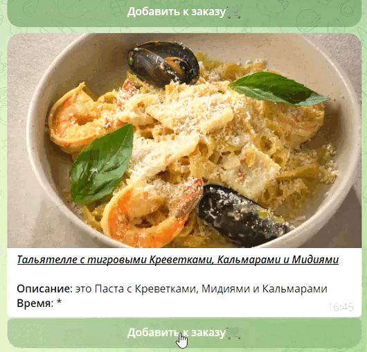

# 🧁Bot-Menu for Catering Establishments


## 🧩 DB shemas

> core > config_main > pg_settings.py

#### Complete table diagrams are presented. They were compiled via pgAdmin4, so I can't be sure of the workability of the tables' code.

> core > data > posgre.py > PgSql

#### The columns and tables in which they are presented are presented there in a more concise form.

## 📝 Project Model Основная идея

A Bot that performs the functions of a ```restaurant menu```, with the ability to ```search for dishes```

#### Reception «**Herringbone**»🌲 (Binary search)
* 1. The visitor moves through groups of dishes
* 2. Adds desired dishes to the order
* 3. Opens the collected order

#### 🔎Search by Elasticsearch
* 1. The visitor types a search query
* 2. There is a relevant output of results divided into groups

## Menu 🍽

> core > menu 

### The choice of dishes is divided into 2-3 groups. Command `/menu`


### If you choose «Роллы🍱» or «Закуски🥪»


### Extradition 🛄


## 🎲 Interaction with dishes

> core > main_order

#### You can ``add`` it ```to the basket``` and then select ```number of dishes('+', '-')```


#### Everything that you add to the order can be viewed using the command `/my_order`


## ⏱️ The arq task in the project

> core > menu > menu_3lvl.py > arq_run()

1. The entire order is in Redis in performance considerations
2. The order is transferred to the database at the end of the business day of the establishment, when the visitors have already left⏰

It's fast, and the order is always available. The DB is not loaded with constant UPDATE queries🌀

```python
hour, minute, second = now.hour - 2, now.minute, now.second
now_in_seconds = 3600 * hour + 60 * minute + second

ttl = day - now_in_seconds
await redis.set(f'_{chat_id}', data)
await arq.enqueue_job('redis_save_n_flush',
                      _defer_by=timedelta(seconds=ttl-300),
                      chat_id=chat_id)
```

## 📃 Orders History

> core > orders_history.py

#### Just saved orders issued with different time constraints🕘. The `/order_history` command


## 🔎 Searching

> core > searching

#### At the request of the user, the groups are issued documents📘 with the appropriate data from Elasticsearch. The search is based on the Name and Description. The index🧶 mapping is located along the path `> core > config_main > index_settings.py`

#### The search pattern is located in `./search_pattern.py`

#### Command `/search`


## Thanks for Reading✨😇
