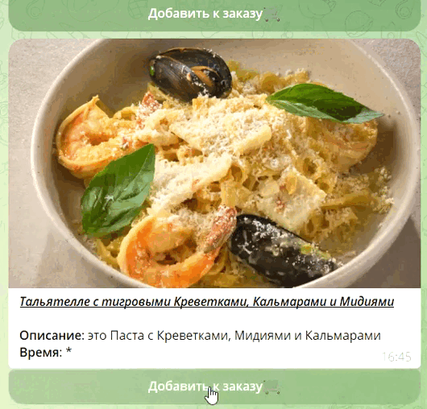

# 🧁Бот-Меню для Ресторанов и Кафе


## 🧩 Таблицы БД 

> core > config_main > pg_settings.py

#### Представлены полные схемы таблиц. Были составлены через PgAdmin4, поэтому не могу быть уверен за работоспосбность кода таблиц

> core > data > posgre.py > PgSql

#### Там представлены столбцы и таблицы, в которых они представлены, в более кратком виде

## 📝 Основная идея

Бот, выполняющий роль ```ресторанного меню```, с возможностью ```поиска блюд```

#### Приём «**Ёлочка**»🌲 (Бинарный поиск)
* 1. Посетитель перемещается по группам блюд
* 2. Добавляет желаемые блюда в заказ
* 3. Открывает собранный заказ
#### 🔎Поиск с помощью Elasticsearch
* 1. Посетитель вводит поисковой запрос
* 2. Происходит релевантная выдача результатов, поделённых на группы

## Меню 🍽

#### Выбор блюда разбит на 2-3 группы. Комманда `/menu` 


### Если выбирают «Роллы🍱» или «Закуски🥪»


### Выдача 🛄


## 🎲 Взаимодействие с блюдами 

#### Ты можешь ```добавить``` его ```в корзину```, после чего выбрать ```количество блюд('+', '-')``` 


#### Всё, что ты добавишь в заказ, можно посмотреть по команде ```/my_order```


## ⏱️ Задача arq в проекте

> core > menu > menu_3lvl.py > arq_run()

1. Весь заказ находится в редисе в соображениях производительности
2. Заказ переносится в БД в конце рабочего дня заведения, когда посетители уже ушли⏰

Это и быстро, и заказ всегда достпуен. БД не нагружается постоянными АПДЕЙТ-запросами

```python
hour, minute, second = now.hour - 2, now.minute, now.second
now_in_seconds = 3600 * hour + 60 * minute + second

ttl = day - now_in_seconds
await redis.set(f'_{chat_id}', data)
await arq.enqueue_job('redis_save_n_flush',
                      _defer_by=timedelta(seconds=ttl-300),
                      chat_id=chat_id)
```

## История заказов

> core > orders_history.py

#### Просто сохранённые заказы, выдаваемые с различными временными ограничениями🕘. Команда `/orders_history`
 

## 🔎 Поиск

> core > searching

#### По запросу пользователя группами выдаются документы📘 из Elasticsearch, с подходящими данными. Поиск ведётся по Названию и Описанию. Маппинг индекса🧶 расположен по пути `> core > config_main > index_settings.py`

#### Поисковой паттерн находится в `./search_pattern.py`

#### Команда `/search`


## Спасибо за прочтение! ✨😇
